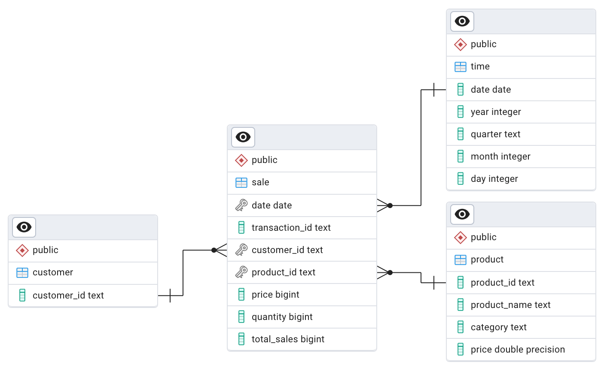

# SmartShop ETL Project  

ETL pipeline project developed for the SmartShop transaction data loading process. This project includes an ETL process 
and a PostgreSQL database setup using Docker Compose. In this ETL process, data is read from a source and then 
transformed before being loaded into the PostgreSQL database, thus allowing users to perform data analysis.

## Running the process

1. Clone the repository:

```bash
git clone https://github.com/ben03500/SmartShopETLProject.git
cd SmartShopETLProject
```

2. Create a `.env` file in the root directory of your project and add the following environment variables:

```env
POSTGRES_DB=your_database_name
POSTGRES_USER=your_database_user
POSTGRES_PASSWORD=your_database_password
DB_PROTOCOL=postgresql+psycopg2
DB_HOST=db
DB_PORT=5432
DB_NAME=your_database_name
DB_USER=your_database_user
DB_PASSWORD=your_database_password
```

3. Check the SQL initialization script (`init_db.sql`) and ensure that the user login credentials match the ones in 
the `.env` file.

4. To build and start the Docker containers, run:

```bash
docker-compose up --build
```
This command will start the PostgreSQL database and the ETL service, which will execute the ETL process defined 
in `main.py`. The data will be processed and loaded into the PostgreSQL database using a Star Schema model.

## Data Model

Please find below the entities and their relations comprising the star schema for this dataset:


  
 ## Business Questions
 i. What are the top 2 best-selling products?

 ***Ans**: Product 1 and 3*
  
```sql
SELECT p.product_id,  
    p.product_name,  
    s.total_sale_quantity  
FROM (  
    SELECT product_id,  
       sum(quantity) AS total_sale_quantity  
    FROM sale s  
    GROUP BY product_id  
    ) s  
LEFT JOIN product p using (product_id)  
ORDER BY s.total_sale_quantity DESC limit 2 
```
ii. What is the average order value per customer?

***Ans**: C001 = $700, C002 = $600, and C003 = $600*
```sql
SELECT customer_id,
	avg(sum_total_sales) AS avg_total_sales
FROM (
	SELECT customer_id,
		transaction_id,
		avg(total_sales) AS sum_total_sales
	FROM sale
	GROUP BY customer_id,
		transaction_id
	) sub
GROUP BY customer_id
```
iii. What is the total revenue generated per product category?

***Ans**: Catagory A = $9,600 and B = $3,200*
```sql
SELECT p.category,  
    sum(total_sales) AS total_sales  
FROM sale s  
LEFT JOIN product p using (product_id)  
GROUP BY p.category  
ORDER BY sum(total_sales) DESC
```
## Design Decision

The goal is to create a minimalistic ETL pipeline using an object-oriented approach instead of the more common
procedural method. This makes the code easier to extend their functionality since each class acts like a self-contained module 
that would foster the reusability of components. The key ETL logic for processing this transaction data is encapsulated 
within the `ETLOrchestrator` class. The class consists of properties that manage the lifecycle of data frames—from
the raw input loaded by the `DataFactory` class through the transformation and to the final state ready for outbound 
processing—thus orchestrating the entire ETL process.

### Assumptions:
- The data is relatively small and can be processed on a standard PC. 
- The type of data quality issues are only those present in the sample data. 
- The source file is singular and will be cumulatively updated in a specified directory. 
- The target relational database is PostgreSQL.

## Potential Future Improvements

- Implement data quality validation, such as checking for consistent customer IDs and product names across company data, 
and ensuring units sold are greater than zero.
- Develop more processes to handle invalid data, such as nullifying them and flagging those inconsistencies.

## Authors

Pattarapong Danpoonkij